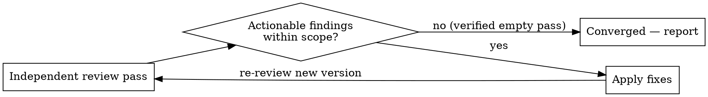

# Review Until Converged

## Overview

A review-improve loop converges only when an **independent review pass returns zero actionable findings**. "Done" is a verified quiet pass — not a feeling that you've run out of ideas. If you stop because the remaining ideas "felt out of scope," you stopped early: you never confirmed the loop went quiet.

Core contract: **the empty pass IS the stop signal. No empty pass, not done.**

## The Loop (recipe)

0. **Set the bar first.** Before pass 1, fix two things explicitly:
   - **Scope** — what artifact, and what is in/out of bounds.
   - **Severity bar** — what counts as *actionable* (e.g. "correctness + clarity defects", not "any conceivable nice-to-have"). Findings below the bar are NOT actionable and do not block convergence.
1. **Independent review pass.** Critique from a genuinely fresh perspective — ideally a separate reviewer (dispatch a subagent / use a review skill), explicitly told to find problems. Do NOT grade your own just-written output from the same head; self-review rubber-stamps.
2. **Triage.** Keep only findings at/above the severity bar and within scope. Drop gold-plating and re-litigation of deliberate decisions.
3. **If actionable findings remain → apply fixes → return to step 1** (re-review the new version).
4. **If zero actionable findings → converged.** That quiet pass is the stop. Report the final artifact.

**Backstop:** cap at ~5 rounds. If still not quiet, you're likely oscillating or the bar is unclear — stop and surface the disagreement to the user rather than looping forever.

## Common Mistakes

- **Vibes-stop.** Stopping when you "feel done" or "ran out of obvious issues" without running a pass that actually returned nothing. Run the confirming pass.
- **Self-review.** Later passes critiquing your own output. Get an independent perspective each pass (fresh subagent / different lens).
- **Gold-plating drift.** Each pass inventing new out-of-scope "improvements" so it never converges (or bloats the artifact). Bound to the severity bar set in step 0.
- **Churn / oscillation.** Changing X, then a later pass changing it back. Track what each pass changed; a finding that re-opens a deliberate prior decision is not actionable.
- **Rubber-stamp reviewer.** A reviewer told "check this" that just approves. Tell the reviewer to actively hunt for defects and default to finding problems.

## Rationalization Table

| Excuse | Reality |
|--------|---------|
| "Remaining ideas felt out of scope, so I stopped." | That's a vibes-stop. Convergence = an independent pass returns nothing *at the bar*, not you deciding the leftovers don't count. Run that pass. |
| "I already reviewed it as I wrote it." | Self-review from the authoring head misses things. One independent pass. |
| "I could keep finding things forever." | Then your severity bar is unset. Fix the bar (step 0); below-bar nits don't block convergence. |
| "One pass is enough, it's clearly good." | The user asked for *until no more feedback*. One pass can't prove that. Loop until a pass is quiet. |
| "It's taking too many rounds." | At the backstop (~5), stop and surface the disagreement — don't fake convergence by lowering effort silently. |

## Red Flags — you're about to stop early

- "I think that's good enough" — without a just-run empty pass.
- The last pass was you reviewing your own edit.
- You stopped because new ideas were "extra," not because there were none at the bar.

**All mean: run one more independent review pass. If it's genuinely empty, THAT is your stop.**
